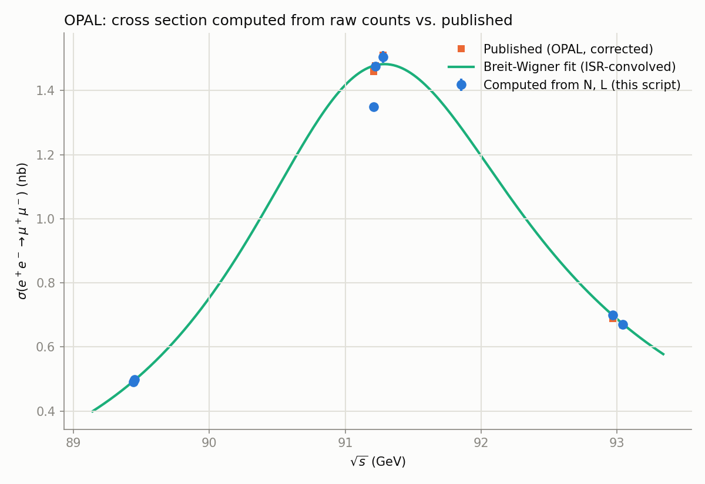
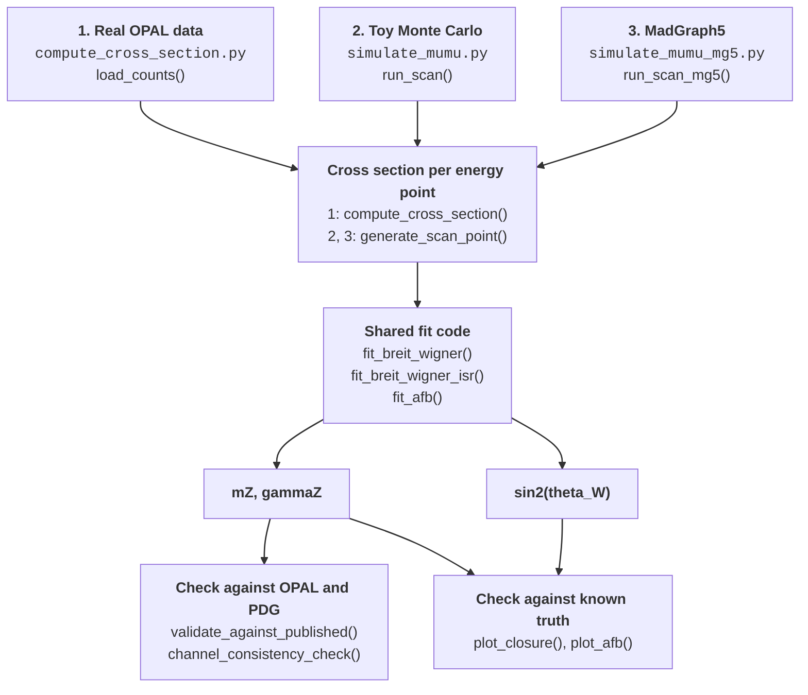
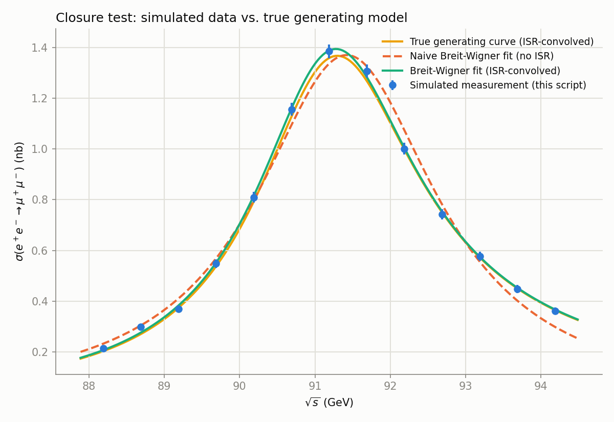
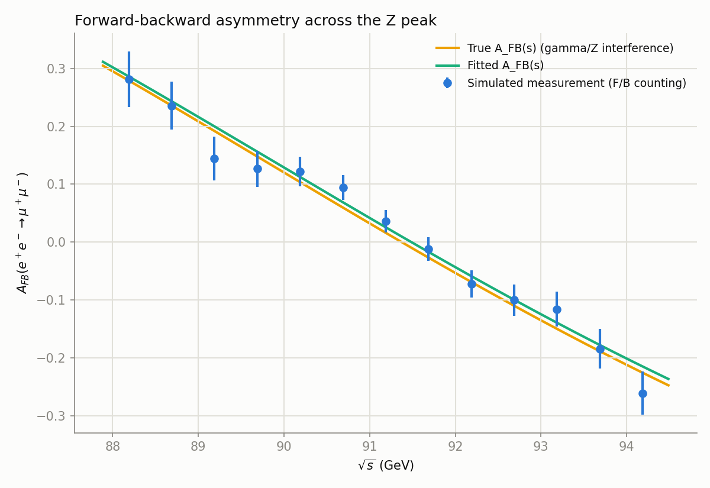

# Measuring the Z boson from raw LEP event counts

When electrons and positrons collide at around 91 GeV they can produce a Z
boson, and the collision rate rises to a sharp peak at that energy. The
position of that peak is the Z mass $M_Z$, and its width is the Z decay width
$\Gamma_Z$, set by how many ways the Z can decay. Mapping out the peak, the Z
"lineshape", was one of the central measurements at LEP.

This project redoes that measurement from the experiment's raw numbers. Given
how many events OPAL counted ($N$), how much beam was delivered ($L$, the
integrated luminosity) and how efficient the detector was ($f$), it computes
the cross section $\sigma = fN/L$ for each type of final state and fits the
peak to get $M_Z$ and $\Gamma_Z$. It also extracts the weak mixing angle
$\sin^2\theta_W$ from a second effect: the muons come out slightly more often
along one beam direction than the other, and how that imbalance changes with
energy is sensitive to $\sin^2\theta_W$. Two closure tests then check the whole
chain against data whose true answer is known in advance.

<p align="center">
  
</p>

The operative word is *computed*. A HEPData cross-section table is the
published answer with nothing left to derive. OPAL's "Zedometry" paper
([hep-ex/0012018][paper]) is unusual in tabulating the *inputs* instead --
$N$, $L$ and $f$, energy point by energy point -- and everything after that is
done here.

[paper]: https://arxiv.org/abs/hep-ex/0012018

---

## Results at a glance

| # | Question | Answer |
|---|---|---|
| 1 | Does $\sigma = fN/L$ reproduce OPAL's published $\mu^+\mu^-$ cross sections? | **6 of 7 points agree to better than 2%**, five of those to better than 1% |
| 2 | What about the 7th? | **1993 "peak" is $-7.5\%$ off**, and the miss is isolated to the two *track-based* channels ($\mu\mu$, $\tau\tau$). The calorimeter channels ($qq$, $ee$) are fine, which points at the luminosity rather than a transcription error |
| 3 | Fit a Breit-Wigner to the clean points, giving $M_Z$, $\Gamma_Z$? | $91.459\,/\,2.799$ GeV, i.e. 272 and 304 MeV above PDG. Good $\chi^2/\mathrm{ndof}$ (0.52/3), wrong answer |
| 4 | Same fit, with QED initial-state radiation convolved in? | $\mathbf{91.179 \pm 0.012\,/\,2.518 \pm 0.019}$ GeV, within $1\sigma$ and $1.2\sigma$ of PDG. ISR was worth $-280$ MeV on both |
| 5 | Is that ISR machinery correct, or just tuned to land on PDG? | Toy-MC closure test against a *known* truth: the no-ISR fit lands $+16.1\sigma\,/\,+9.8\sigma$ off, the ISR fit $-1.2\sigma\,/\,-0.4\sigma$ off. It recovers the generating parameters |
| 6 | Can a second, independent observable come out of the same events? | $\sin^2\theta_W^{\mathrm{eff}} = 0.22596 \pm 0.00343$ from the forward-backward asymmetry (true input 0.23155, $-1.6\sigma$) |
| 7 | Does it still work when the truth model is not my own code? | With MadGraph5-generated events and ISR switched off at the generator, the **naive fit now wins** and the ISR fit is $-8.7\sigma$. That inversion is the correct behaviour, and is the strongest evidence the ISR correction does real work |

Rows 3 and 4 are the physics result. Rows 5 to 7 are the evidence that row 4
is not a coincidence.

---

## Quick start

```bash
python3 -m venv .venv && source .venv/bin/activate
pip install -r requirements.txt

python src/compute_cross_section.py   # real OPAL data: rows 1-4 above
python src/simulate_mumu.py           # toy-MC closure test: rows 5-6
python src/simulate_mumu_mg5.py       # generator-level closure: row 7 (needs MadGraph5)
```

Each script prints to stdout and writes tables and plots to `data/processed/`
(gitignored). The toy MC is seeded, so `simulate_mumu.py` reproduces the
numbers quoted here exactly. Only the third needs anything beyond
`requirements.txt`.

---

## How it fits together



Three event sources feed one shared analysis stage. Only the source changes:
the code that turns cross sections into $M_Z$, $\Gamma_Z$ and
$\sin^2\theta_W$ is the same in all three cases, which is what lets the
closure tests say anything about the real measurement.

| Script | Event source | What it establishes |
|---|---|---|
| `compute_cross_section.py` | Real OPAL tables | The measurement itself, and that ISR matters |
| `simulate_mumu.py` | Toy MC from a known truth model | The fit recovers truth, so the ISR correction is real rather than fitted to taste |
| `simulate_mumu_mg5.py` | MadGraph5_aMC@NLO matrix elements | The truth model no longer shares an author with the fit model |

Each exists because of a hole in the one before it. Open a section for detail.

---

<details>
<summary><b>0. Theory background: where these formulas come from</b> (read this first if the rest looks like magic)</summary>

Everything below is standard electroweak theory, written out at the level the
code actually uses. Conventions: natural units $\hbar = c = 1$, metric
$(+,-,-,-)$, $s = E_{\mathrm{cm}}^2$. Cross sections come out in
$\mathrm{GeV}^{-2}$ and are converted with
$(\hbar c)^2 = 3.894 \times 10^5\ \mathrm{GeV}^2\,\mathrm{nb}$.

### 0.1 Why there is a peak at all

An electron and a positron annihilate into a single virtual particle that
then decays: this is an *s-channel* process. The intermediate Z carries the
full collision energy, so its propagator controls the rate. An unstable
particle has a complex pole, and the amplitude near it behaves as

$$\mathcal{M}(s) \;\propto\; \frac{1}{s - M_Z^2 + i M_Z \Gamma_Z}$$

The rate goes as $|\mathcal{M}|^2$, which turns the complex pole into the
resonance shape:

$$|\mathcal{M}(s)|^2 \;\propto\; \frac{1}{(s - M_Z^2)^2 + M_Z^2\Gamma_Z^2}$$

This is the Breit-Wigner. It peaks at $s = M_Z^2$ and falls to half maximum at
$\sqrt{s} \approx M_Z \pm \Gamma_Z/2$. **The peak position measures the mass,
the peak width measures the decay width** -- the entire logic of a lineshape
measurement.

The overall size needs one more ingredient: the Z must be produced from
$e^+e^-$ ($\propto \Gamma_{ee}$) and decay to the channel you look at
($\propto \Gamma_{ff}$), against a total rate $\Gamma_Z$. With the spin
counting -- 3 Z polarizations against $2\times2$ initial states -- this gives

$$\sigma^{\mathrm{peak}}_{ff} = \frac{12\pi}{M_Z^2}\,\frac{\Gamma_{ee}\Gamma_{ff}}{\Gamma_Z^2}, \qquad 12\pi = 16\pi \times \frac{3}{4}$$

PDG numbers ($\Gamma_{\ell\ell} = 83.99$ MeV) give **1.9997 nb**, which is what
LEP measured. `simulate_mumu.py` derives its truth normalization this way
rather than choosing it, which is what gives the closure test something real to
close on.

### 0.2 Fixed width, running width, and what "the Z mass" means

The $i M_Z\Gamma_Z$ above treats the width as a constant. It is not: the Z
self-energy grows with energy, so the physically correct replacement is
$M_Z\Gamma_Z \to s\,\Gamma_Z/M_Z$. The two denominators are

$$D_{\mathrm{fix}}(s) = (s-M_Z^2)^2 + M_Z^2\Gamma_Z^2, \qquad D_{\mathrm{run}}(s) = (s-M_Z^2)^2 + \frac{s^2\Gamma_Z^2}{M_Z^2}$$

These are not two competing models. They are the *same curve* with different
parameter names. Writing $k = 1 + \Gamma_Z^2/M_Z^2$, one can show exactly
(verified symbolically, not by eye) that

$$D_{\mathrm{run}}(s;\,M_Z,\Gamma_Z) = k \cdot D_{\mathrm{fix}}\!\left(s;\ \frac{M_Z}{\sqrt{k}},\ \frac{\Gamma_Z}{\sqrt{k}}\right)$$

so a fixed-width fit to running-width data returns a *smaller* mass:

$$M_Z - \bar{M}_Z = M_Z\left(1 - \frac{1}{\sqrt{k}}\right) \simeq \frac{\Gamma_Z^2}{2M_Z} = 34\ \mathrm{MeV}$$

34 MeV is not a rounding error at LEP precision, which is why the convention is
quoted with every published $M_Z$. **A mass is only comparable to PDG once you
say which propagator produced it.**

This repo uses a third form, the non-relativistic Breit-Wigner in $\sqrt{s}$:

$$\sigma(\sqrt{s}) = \sigma_{\mathrm{peak}}\frac{(\Gamma_Z/2)^2}{(\sqrt{s}-M_Z)^2 + (\Gamma_Z/2)^2}$$

Near the peak it agrees with the fixed-width form, since
$s - M_Z^2 \approx 2M_Z(\sqrt{s}-M_Z)$; it differs in the wings, and in the
numerator (constant rather than $\propto s$). Those two differences pull $M_Z$
in opposite directions on this dataset, so swapping in the full LEP form moves
the fitted mass by only $\sim 5$ MeV without ISR and essentially nothing with
it -- a cancellation, not an absence of the effect. See Caveats.

### 0.3 The Z is not the only thing being exchanged

$e^+e^- \to \mu^+\mu^-$ also proceeds through a virtual photon, and the photon
and Z amplitudes *interfere*. Writing the propagator ratio

$$\chi(s) = \frac{G_F M_Z^2}{2\sqrt{2}\,\pi\alpha}\cdot\frac{s}{s - M_Z^2 + i M_Z\Gamma_Z}$$

and the lepton neutral-current couplings

$$v = -\tfrac{1}{2} + 2\sin^2\theta_W, \qquad a = -\tfrac{1}{2}$$

the differential cross section in the improved Born approximation is

$$\frac{d\sigma}{d\Omega} = \frac{\alpha^2}{4s}\Big[(1+\cos^2\theta)\,F_1(s) + \cos\theta\,F_2(s)\Big]$$

$$F_1 = \underbrace{Q_\ell^4}_{\gamma\ \mathrm{only}} - \underbrace{2Q_\ell^2 v^2\,\mathrm{Re}\,\chi}_{\gamma/Z\ \mathrm{interference}} + \underbrace{(v^2+a^2)^2|\chi|^2}_{Z\ \mathrm{only}}, \qquad F_2 = -4Q_\ell^2a^2\,\mathrm{Re}\,\chi + 8(va)^2|\chi|^2$$

The three pieces of $F_1$ are the point: **a pure Breit-Wigner keeps only the
last one.** The interference term carries $\mathrm{Re}\,\chi$, which changes
sign across the resonance, so dropping it distorts the lineshape
*antisymmetrically* about the peak -- exactly the direction that biases a mass.

Two integrals follow. Over the full solid angle the $\cos\theta$ term vanishes
and $\int d\Omega\,(1+\cos^2\theta) = 16\pi/3$, so

$$\sigma(s) = \frac{\alpha^2}{4s}\cdot\frac{16\pi}{3}F_1(s)$$

and splitting the forward and backward hemispheres, with
$\int_0^1(1+c^2)dc = 4/3$ and $\int_0^1 c\,dc = 1/2$,

$$A_{\mathrm{FB}} = \frac{F-B}{F+B} = \frac{F_2}{\tfrac{8}{3}F_1} = \frac{3}{8}\frac{F_2(s)}{F_1(s)}$$

which is the `0.375 * f2 / f1` in the code. Because $F_2$ is dominated by
$\mathrm{Re}\,\chi$ near the peak, $A_{\mathrm{FB}}$ flips sign as $\sqrt{s}$
crosses $M_Z$: the sign flip in the asymmetry plot is the interference term
made directly observable.

The same couplings fix the leptonic partial width,

$$\Gamma_{\ell\ell} = \frac{G_F M_Z^3}{6\sqrt{2}\,\pi}(v^2+a^2) = 83.4\ \mathrm{MeV}$$

against PDG's $\sim 84$ MeV. That is what makes the sanity checks printed by
`simulate_mumu.py` meaningful: an unrelated formula reproduces a measured
number, so the coupling conventions are right.

### 0.4 Two different $\sin^2\theta_W$

$\sin^2\theta_W$ has more than one definition, and they differ numerically --
which matters when comparing sections 2 and 3:

| Definition | Value | Where it appears here |
|---|---|---|
| on-shell, $1 - M_W^2/M_Z^2$ | 0.2222 | MadGraph5 `param_card.dat` truth (section 3) |
| effective, $\sin^2\theta_W^{\mathrm{eff}}$ | 0.23155 | PDG value used as toy truth (section 2) |

The $\sim 0.009$ gap is physical, not a discrepancy: the on-shell definition is
a tree-level relation between measured masses, the effective one absorbs loop
corrections into the coupling $A_{\mathrm{FB}}$ actually measures. Quoting a
fitted asymmetry against the wrong one is a $2.5\%$ error from bookkeeping
alone.

### 0.5 Initial-state radiation, and why it biases the mass

Before annihilating, the electron or positron can radiate a photon, so the
annihilation happens at a *lower* effective energy
$\sqrt{s'} = \sqrt{s}\sqrt{1-x}$. Radiation only ever goes one way -- you
cannot radiate energy *into* a collision -- so the distortion is one-sided:
**the observed peak sits too high in energy and is smeared toward the low
side.** Fitting an unradiated Breit-Wigner to radiated data therefore returns
too large a mass and width, which is exactly what this project sees
(+272 MeV, +304 MeV).

The correction convolves with the probability $H(x)$ of losing a fraction $x$:

$$\sigma_{\mathrm{obs}}(s) = \int_0^{x_{\max}} H(x)\,\sigma_{\mathrm{born}}\big(s(1-x)\big)\,dx$$

In the leading-log (Kuraev-Fadin) structure-function approach, soft and virtual
photons exponentiate into a power law and the first hard-photon correction is
kept explicitly:

$$H(x) = \beta\,x^{\beta-1}\left(1 - \frac{x}{2}\right), \qquad \beta = \frac{2\alpha}{\pi}\left(\ln\frac{s}{m_e^2} - 1\right)$$

At the Z, $\beta = 0.1077$. The exponent is negative ($x^{-0.89}$), so $H$
diverges as $x \to 0$ -- infinitely many arbitrarily soft photons -- but
integrably: $\int_0^1 \beta x^{\beta-1}dx = 1$ exactly, the statement that
*something* always happens. With the hard term,
$\int_0^1 H\,dx = 1 - \beta/(2(1+\beta)) = 0.951$; the missing $5\%$ is
radiation hard enough to leave the truncation's domain.

Two practical consequences:

- The $x^{\beta-1}$ endpoint singularity has to survive numerical integration.
  It does: `scipy.integrate.quad` handles it to a relative accuracy of
  $6\times10^{-11}$, checked against the substitution $u = x^\beta$, which
  removes the singularity analytically.
- $x_{\max}$ can be 1 for a pure Breit-Wigner, since the resonance itself
  suppresses the large-$x$ tail. It **cannot** once the photon-exchange term of
  $F_1$ is included: that term grows as $1/s'$, so radiating away almost all the
  energy diverges. This is *radiative return*, and a real experiment removes it
  with a cut on the reconstructed $\sqrt{s'}$ -- so adding the interference
  term requires knowing OPAL's own cut. It is not a free choice.

### 0.6 What is being computed from the data

A detector counts $N$ events while the accelerator delivers integrated
luminosity $L$. The cross section is the rate per unit luminosity, corrected
for what the detector did to the sample -- efficiency below 1, background above
0 -- which OPAL packages into one factor $f$ per channel and energy point:

$$\sigma = \frac{f N}{L}$$

The statistical error is Poisson, $\sqrt{N}$; the systematic error is the
uncertainty on $f$. That is the whole of section 1's arithmetic -- and the
reason the raw tables beat the published cross sections: those are the
left-hand side, and this project wants the right-hand side.

</details>

<details>
<summary><b>1. Real OPAL data: the measurement</b> (<code>src/compute_cross_section.py</code>)</summary>

### The calculation

From OPAL's Table 1 (the event counts $N$ and luminosity $L$ per energy point,
29 rows, 1990-1995) and the per-channel correction factors $f$ (Tables 3, 5, 6,
7):

$$\sigma = \frac{f N}{L}$$

in nb, with Poisson ($\sqrt{N}$) and systematic (correction-factor) errors
propagated through the `uncertainties` package. Correction factors are only
tabulated for 7 of the 29 points (1993/1995 peak$-2$, peak, peak$+2$ and 1994
peak), so those 7 are what the script computes.

### The cross-channel check

All four final states share the same luminosity column, so a discrepancy
confined to one or two channels means something channel-specific rather than a
bad $L$ or a typo. Percent difference from published:

| year | sample | $qq$ | $ee$ | $\mu\mu$ | $\tau\tau$ |
|---|---|---|---|---|---|
| 1993 | **peak** | $-0.62$ | $-0.61$ | $\mathbf{-7.53}$ | $\mathbf{-4.05}$ |
| 1993 | peak+2 | 0.53 | 0.60 | 0.39 | 0.92 |
| 1993 | peak-2 | 0.28 | 0.68 | 0.64 | 0.34 |
| 1994 | peak(ab) | $-0.12$ | $-1.83$ | $-0.11$ | $-0.93$ |
| 1995 | peak | 0.16 | 0.31 | $-0.43$ | $-0.37$ |
| 1995 | peak+2 | 0.56 | 1.13 | 1.61 | 1.11 |
| 1995 | peak-2 | 0.40 | 0.71 | 0.08 | 0.19 |

Only the track-based selections ($\mu\mu$, $\tau\tau$) are off at 1993 peak;
the calorimeter-based ones ($qq$, $ee$) are clean. The paper itself notes that
Table 1's luminosity is nominally the $qq$-selection value and can differ for
other channels "by about 1%". For this run period it evidently differed by much
more, most plausibly a tracking-subdetector livetime gap the calorimeter
channels did not share.

### The lineshape fit

`iminuit` fit of a Breit-Wigner to the computed $\mu^+\mu^-$ points, in three
passes:

| Fit | $\chi^2/\mathrm{ndof}$ | $M_Z$ (GeV) | $\Gamma_Z$ (GeV) | $\sigma_{\mathrm{peak}}$ (nb) |
|---|---|---|---|---|
| All 7 points, no ISR | 76.33/4 | $91.4630 \pm 0.0103$ | $2.8289 \pm 0.0216$ | $1.5002 \pm 0.0067$ |
| 6 clean points, no ISR | 0.52/3 | $91.4594 \pm 0.0103$ | $2.7992 \pm 0.0214$ | $1.5204 \pm 0.0071$ |
| 6 clean points, ISR-convolved | 1.78/3 | $\mathbf{91.1794 \pm 0.0118}$ | $\mathbf{2.5181 \pm 0.0192}$ | $2.1651 \pm 0.0095$ |
| *PDG* | | *$91.1876 \pm 0.0021$* | *$2.4955 \pm 0.0023$* | |

The 0.52/3 in the middle row is a warning, not a success: three fit parameters
against only three distinct $\sqrt{s}$ clusters is an almost-exact fit by
construction. A good $\chi^2$ hid a 272 MeV bias.

### The ISR correction

The third row convolves the Breit-Wigner with the QED radiator $H(x)$ of
section 0.5, integrated numerically with `scipy.integrate.quad`. It is a
truncated leading-log treatment, not the ZFITTER-level radiator LEP itself
used: enough to get the direction and rough size of the effect out of six
points, not enough for LEP precision.

</details>

<details>
<summary><b>2. Toy-MC closure test: does the pipeline recover a known truth?</b> (<code>src/simulate_mumu.py</code>)</summary>

### Why this exists

Section 1 still consumes OPAL's own $N$, $L$ and $f$. The arithmetic is real,
but every input was already somebody else's analysis output, and "the answer
came out near PDG" is weak evidence: PDG is exactly where a subtly wrong fit
would be nudged. So generate a sample from a truth model you control, run the
*same* fit functions on it (`fit_breit_wigner` and `fit_breit_wigner_isr`,
imported unmodified from `compute_cross_section.py`), and check whether they
return what went in.

### The toy

- **Truth model**: $M_Z$ and $\Gamma_Z$ fixed to PDG; the peak cross section is
  *derived*, not chosen, from
  $\sigma_{\mathrm{peak}} = (12\pi/M_Z^2)\,\Gamma_{ee}\Gamma_{\mu\mu}/\Gamma_Z^2$
  using PDG's leptonic partial width, giving 1.9997 nb, matching the
  $\sim 2.0$ nb LEP measured.
- **Angular distribution**:
  $(1+\cos^2\theta) + \tfrac{8}{3}A_{\mathrm{FB}}(s)\cos\theta$, with the real
  energy-dependent $\gamma/Z$ interference asymmetry rather than a constant.
- **Acceptance**: a dedicated 500,000-event sample gives
  $\hat{A} = 0.9271 \pm 0.0004$ for a $|\cos\theta| < 0.95$ cut. Every point is
  corrected by that same $\hat{A}$, derived once from simulation and never from
  the point's own data -- structurally what OPAL's $f$ does, computed here
  instead of read from a paper.
- **Scan**: 13 points, $M_Z \pm 3$ GeV in 0.5 GeV steps (against only 3
  distinct clusters in the real data), 2 pb<sup>-1</sup> each.

### Result

<p align="center">
  
</p>

| Fit | $\chi^2/\mathrm{ndof}$ | $M_Z$ (GeV) | $\Gamma_Z$ (GeV) | pull vs. **true input** |
|---|---|---|---|---|
| Naive (no ISR) | 67.46/10 | $91.4205 \pm 0.0145$ | $2.9188 \pm 0.0431$ | $\mathbf{+16.1\sigma\,/\,+9.8\sigma}$ |
| ISR-convolved | 5.82/10 | $91.1701 \pm 0.0144$ | $2.4808 \pm 0.0404$ | $\mathbf{-1.21\sigma\,/\,-0.36\sigma}$ |

With 13 well-separated points instead of 3 clusters, the missing-ISR bias can
no longer hide inside a flattering $\chi^2/\mathrm{ndof}$ as it nearly did on
the real data; it shows up as an outright bad fit. And the same ISR treatment
that only got the real-data fit within $\sim 1\sigma$ of PDG here recovers the
generating parameters well inside its own statistical uncertainty.

### Second observable: forward-backward asymmetry

The lineshape fit says nothing about the weak mixing angle.
$A_{\mathrm{FB}}$ does: its energy dependence comes from $\gamma/Z$
interference and its shape is sensitive to $\sin^2\theta_W^{\mathrm{eff}}$, the
other classic LEP Z-pole observable, extracted here as a genuinely new quantity
rather than fed in from OPAL or PDG.

The formalism is section 0.3: $A_{\mathrm{FB}} = (3/8)F_2/F_1$, with $F_1$ and
$F_2$ built from the $\gamma/Z$ propagator ratio and the lepton couplings. It
is a *different* approximation from the non-relativistic `breit_wigner()` used
for the rate fit -- two approximations for two observables in one script,
deliberately, not a bug. Two sanity checks print on every run before anything
downstream is trusted: $\Gamma_{ee}$ from the same couplings gives 83.39 MeV
against PDG's $\sim 84$, and integrating $F_1$ at $s = M_Z^2$ gives
$\sigma_{\mathrm{peak}} = 1.9818$ nb against the independently derived
1.9997 nb. Two unrelated formulas agreeing is evidence the normalization is
right, not just plausible-looking.

Accepted events are split by sign of $\cos\theta$, giving
$A_{\mathrm{FB}} = (F-B)/(F+B)$ with error $\sqrt{(1-A_{\mathrm{FB}}^2)/N}$. A
second fit holds $M_Z$ and $\Gamma_Z$ at the ISR-convolved lineshape values and
fits $\sin^2\theta_W^{\mathrm{eff}}$ as the only free parameter, mirroring the
real two-step LEP procedure.

<p align="center">
  
</p>

$\chi^2/\mathrm{ndof} = 7.50/12$ and
$\sin^2\theta_W^{\mathrm{eff}} = 0.22596 \pm 0.00343$ against the true input
0.23155, a $-1.63\sigma$ pull. The measured points trace the expected sign flip
across the peak, positive below and negative above.

### Known limitations

- The closure test validates *self-consistency* of the ISR treatment, not
  agreement with an independent higher-order QED calculation: the same
  truncated leading-log radiator both generates and fits the sample, so a
  shared blind spot inside it would not show up here. Section 3 exists to
  attack exactly that.
- Constant toy luminosity and a flat $|\cos\theta|$ acceptance cut, not real
  detector geometry or a realistic efficiency curve.
- Only leptonic couplings are modeled. A real
  $\sin^2\theta_W^{\mathrm{eff}}$ extraction combined multiple final states at
  far higher statistics; $-1.63\sigma$ from 13 points at 2 pb<sup>-1</sup> is
  an ordinary statistical fluctuation, not a precision claim.

</details>

<details>
<summary><b>3. Generator-level closure test: truth from MadGraph5</b> (<code>src/simulate_mumu_mg5.py</code>)</summary>

### Why this exists

Section 2 has one blind spot left: the truth model (`a_fb_true`) and the fit
model are the same code, written by the same author in the same sitting, so a
shared bug there would not register as a fit failure. This script replaces the
event source with **MadGraph5_aMC@NLO** -- an independently implemented
Standard Model matrix-element calculation for $e^+e^- \to \mu^+\mu^-$ (2
tree-level diagrams, $s$-channel photon and $Z$), run as a point-particle
lepton collider with no PDF, no shower and no detector step, muon 4-momenta
read straight off the parton-level LHE record.

Everything downstream is reused unchanged: `fit_breit_wigner`,
`fit_breit_wigner_isr`, `fit_afb`, `plot_closure`, `plot_afb`, and the same
$|\cos\theta| < 0.95$ acceptance and forward/backward counting. Only the event
source changes.

### Ground truth is read, not typed

From MadGraph5's own `param_card.dat`: $M_Z = 91.1880$ GeV,
$\Gamma_Z = 2.4414$ GeV, and the *dependent* on-shell W mass
$M_W = 80.4190$ GeV, which MG5 derives itself from $M_Z$, $G_F$ and
$\alpha_{\mathrm{EW}}$. Hence

$$\sin^2\theta_W^{\text{on-shell}} = 1 - \left(\frac{M_W}{M_Z}\right)^2 = 0.2222$$

This is **not** PDG's effective $\sin^2\theta_W^{\mathrm{eff}} = 0.23155$ used
in section 2 -- see section 0.4 for why the two differ by $\sim 0.009$. This
script fits and reports the on-shell number.

**Per scan point**: one MG5 launch at that $\sqrt{s}$ (point beams,
`nevents=1200`); MG5's own VEGAS-integrated cross section sets the kept-event
count to
$n_{\mathrm{keep}} = \mathrm{Poisson}(0.3\,\mathrm{pb}^{-1} \times \sigma_{\mathrm{MG5}})$,
which is where Poisson luminosity statistics enter on top of MG5's otherwise
deterministic event count. Acceptance is measured as in section 2, from a
dedicated 8,000-event MG5 sample at the pole: $\hat{A} = 0.9634 \pm 0.0021$.

### Result: the fits swap places, and that is correct

| Fit | $\chi^2/\mathrm{ndof}$ | $M_Z$ (GeV) | $\Gamma_Z$ (GeV) | pull vs. param_card truth |
|---|---|---|---|---|
| Naive (no ISR) | 8.24/10 | $91.1919 \pm 0.0271$ | $2.4837 \pm 0.0729$ | $\mathbf{+0.14\sigma\,/\,+0.58\sigma}$ |
| ISR-convolved | 18.97/10 | $90.9497 \pm 0.0275$ | $2.0604 \pm 0.0688$ | $\mathbf{-8.67\sigma\,/\,-5.54\sigma}$ |

The naive fit beating the ISR fit is the opposite of every other fit here, and
it is right. This MG5 process has ISR/beamstrahlung off by default (a scope
choice, below), so the true generating lineshape really *is* ISR-free, and
convolving in a radiator that is not there over-corrects the peak downward --
the mirror image of the real OPAL data, which does have ISR and where the naive
fit was the biased one. That symmetry is the value of this script: the ISR
machinery moves the answer in the physically correct direction *in both
directions*, rather than always nudging toward the expected number.

The $A_{\mathrm{FB}}$ fit therefore fixes $M_Z$/$\Gamma_Z$ from the **naive**
fit here, unlike section 2 where the ISR-convolved fit was the correct choice
for OPAL's ISR-affected data:

$\chi^2/\mathrm{ndof} = 13.97/12$ and
$\sin^2\theta_W^{\text{on-shell}} = 0.25000 \pm 0.01874$ against the
param_card truth 0.22225, a $+1.48\sigma$ pull, an ordinary fluctuation for 13
points. In `data/processed/simulated_mumu_mg5_closure.png` the naive fit and
the true curve sit on top of each other while the ISR curve visibly diverges;
`..._mg5_afb.png` shows the same clean sign flip as the pure-Python toy.

### Running it

Needs a MadGraph5_aMC@NLO installation -- external to this repo, multi-GB,
needs `gfortran`/`gcc`, deliberately not in `requirements.txt`. Point
`MG5_PATH` at your `bin/mg5_aMC` if it is not at the script's default. Unlike
the other two this one shells out to generate events: the 13-point scan plus
the acceptance sample takes 1-2 minutes.

### Known limitations

- Parton-level only: no PDF (correct for a lepton collider), no
  ISR/beamstrahlung, no shower, no detector simulation. A scope choice, not an
  oversight -- the project's answer to referencing a real collider's
  generate/detector/analysis structure without the full Pythia8/Delphes/FastJet
  chain that hadronic LHC final states need. MadGraph5 $\geq$ 3.2.0 does
  support ISR/beamstrahlung for lepton colliders, the natural next step.
- The "true" reference curve in the closure plot still uses the
  non-relativistic fixed-width `breit_wigner()` shape (pinned to MG5's own
  precise on-peak cross section) as a stand-in for MG5's fully relativistic
  propagator: adequate near the peak, and the source of the small residual
  mismatch visible in the wings.

</details>

---

## Data

Everything in `data/raw/` was transcribed by hand from the paper's tables and
page-checked against the PDF.

| File | Paper table | Contents |
|---|---|---|
| `opal_zedometry_table1_event_counts.csv` | Table 1 | $N$ (qq/ee/mumu/tautau) and $L$ per energy point, 1990-1995, 29 rows: **the actual raw input** |
| `opal_zedometry_table{3,5,6,7}_*_corrections.csv` | 3, 5, 6, 7 | Correction factor $f$ and its systematic error, one file per final state. Only tabulated for 7 points |
| `opal_zedometry_table{8,9,10,11}_*_xsec_published.csv` | 8-11 | OPAL's own published cross sections, used **only** to validate the computed values, never as calculation input |
| `HEPData-ins1808875-v1-Table_1.csv` | | BESIII $e^+e^- \to \mu^+\mu^-$ ([arXiv:2007.12872](https://arxiv.org/abs/2007.12872)), an earlier dead end: a *final* published result with nothing left to compute. Kept for the record |
| `opal_zedometry_hep-ex-0012018.pdf` | | Source paper, for provenance (not tracked in git) |

## Repository layout

```
src/
  compute_cross_section.py   1. real OPAL data: compute -> validate -> fit
  simulate_mumu.py           2. toy-MC closure test + A_FB
  simulate_mumu_mg5.py       3. generator-level closure test (MadGraph5)
data/raw/                       hand-transcribed OPAL tables (tracked)
data/processed/                 script output: tables and plots (gitignored)
figures/                        the plots this README embeds (tracked)
```

## Caveats and next steps

Per-script limitations are inside each section above. Project-wide:

- **The ISR radiator is a truncated leading-log approximation**: no
  multi-photon exponentiation beyond leading log, no exact
  $\mathcal{O}(\alpha^2)$ terms. Enough to show the effect exists and roughly
  how large it is; not enough to claim LEP-level precision from six points.
- **Only 3 distinct energy points constrain the real-data fit**
  (peak$-2$, peak, peak$+2$). The other points in Table 1 have no published
  correction factors, so no trustworthy cross section can be computed from
  them. More points would make a good $\chi^2/\mathrm{ndof}$ mean something
  stronger than "3 parameters matched 3 clusters".
- **Only $\mu^+\mu^-$ gets the full compute, validate, fit pipeline**; $qq$,
  $ee$ and $\tau\tau$ are used only for the cross-channel consistency check.
- **The lineshape model omits photon exchange and $\gamma/Z$ interference**
  (section 0.3 explains why that matters, and `simulate_mumu.py` already
  implements the terms for the asymmetry side). Refitting with them included
  moves $M_Z$ by roughly $-30$ MeV, about $2.5\times$ the quoted fit
  uncertainty, and brings $\Gamma_Z$ closer to PDG. **The quoted $\pm 12$ MeV
  is therefore optimistic**: it is a statistical error on a model whose choice
  is worth more than the error itself. Including the term also requires
  matching OPAL's own $\sqrt{s'}$ selection cut, because the photon term makes
  the ISR integral cut-dependent (radiative return, section 0.5).
- **The propagator convention is not the LEP one.** The fit uses a
  non-relativistic Breit-Wigner in $\sqrt{s}$; published $M_Z$ values come from
  the relativistic running-width form, and the two mass definitions differ by
  $\Gamma_Z^2/2M_Z \approx 34$ MeV (section 0.2). On this dataset the net
  effect of switching happens to be small ($\sim 5$ MeV, and under $1$ MeV once
  ISR is included) because the numerator and denominator differences cancel,
  but that cancellation is a coincidence of this parametrization, not a reason
  the convention does not matter.
- **Natural extensions**: a joint multi-channel fit for a more realistic
  precision-electroweak treatment; enabling MG5's own ISR/beamstrahlung so
  there is a genuinely ISR-affected generator truth to test the ISR-convolved
  fit against; a Pythia8/Delphes-style shower and detector-smearing step for a
  detector-level closure test.

## Reference

G. Abbiendi et al. (OPAL Collaboration), *Precision luminosity for
$Z^0$ lineshape measurements with a silicon-tungsten luminometer*,
Eur. Phys. J. **C19** (2001) 587-651, [hep-ex/0012018][paper].
